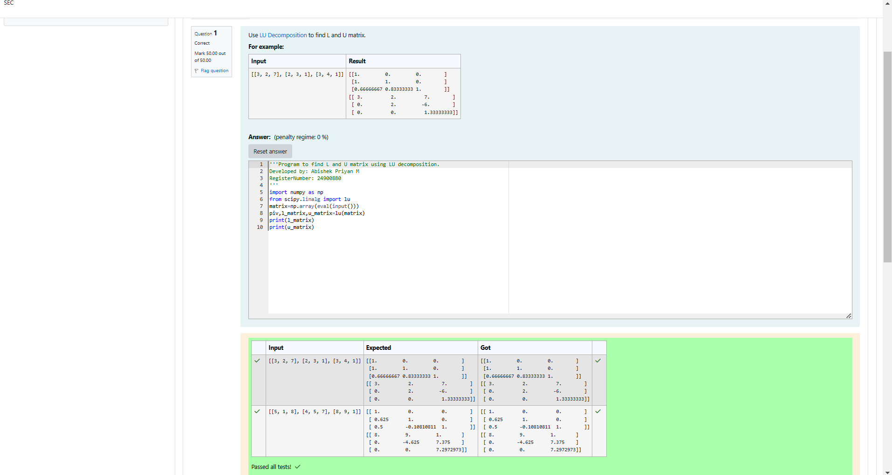
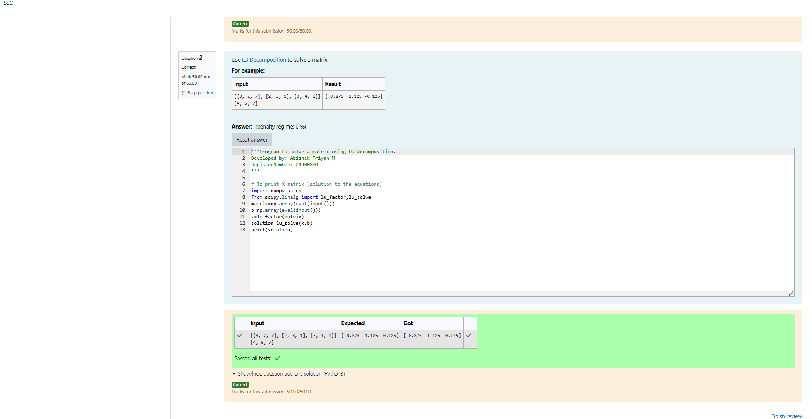

# LU Decomposition 

## AIM:
To write a program to find the LU Decomposition of a matrix.

## Equipments Required:
1. Hardware – PCs
2. Anaconda – Python 3.7 Installation / Moodle-Code Runner

## Algorithm 1
1. Import the numpy module to perform numerical operations.
2. Import lu from scipy.linalg for LU decomposition.
3. Prepare the input matrix using np.array() from user input.
4. Apply the lu() function to decompose the matrix.
5. Extract the Lower (L) and Upper (U) triangular matrices.
6. Print the L matrix.
7. Print the U matrix.
8. End the program.

## Algorithm 2
1. Import numpy for numerical operations.
2. Import lu_factor and lu_solve from scipy.linalg.
3. Read the coefficient matrix as input using np.array(eval(input())).
4. Read the constant vector as input using np.array(eval(input())).
5. Decompose the matrix using lu_factor().
6. Solve the equations using lu_solve().
7. Print the solution vector.
8. End the program.

## Program:
(i) To find the L and U matrix

```
'''Program to find L and U matrix using LU decomposition.
Developed by: Abishek Priyan M
RegisterNumber: 24900880 
'''
import numpy as np
from scipy.linalg import lu
matrix=np.array(eval(input()))
piv,l_matrix,u_matrix=lu(matrix)
print(l_matrix)
print(u_matrix)

```
(ii) To find the LU Decomposition of a matrix
```
'''Program to solve a matrix using LU decomposition.
Developed by: Abishek Priyan M 
RegisterNumber: 24900880
'''

# To print X matrix (solution to the equations)
import numpy as np
from scipy.linalg import lu_factor,lu_solve
matrix=np.array(eval(input()))
b=np.array(eval(input()))
x=lu_factor(matrix)
solution=lu_solve(x,b)
print(solution)
```

## Output:





## Result:
Thus the program to find the LU Decomposition of a matrix is written and verified using python programming.

